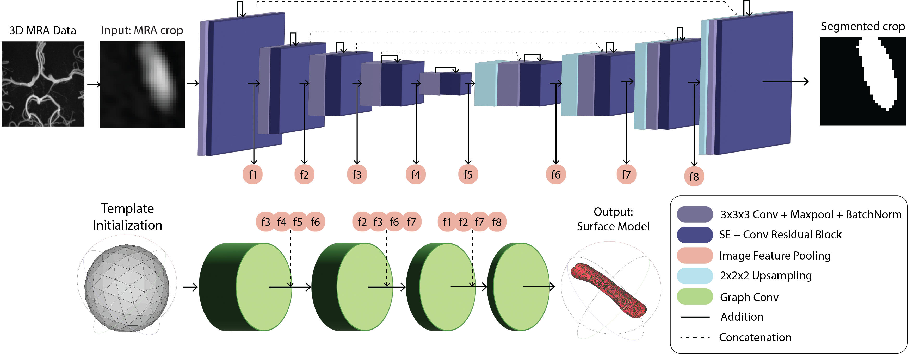

# A Deep Learning Approach for Direct Mesh Reconstruction of Intracranial Arteries

This repository is based on the PyTorch implementation of Voxel2Mesh architecture proposed in *Voxel2Mesh: 3D Mesh Model Generation from Volumetric Data*; Udaranga Wickramasinghe, Edoardo Remelli, Graham Knott and Pascal Fua; MICCAI 2020. 

## Abstract

The Circle of Willis (CoW) is a group of vessels connecting major circulations of the brain. Its vascular geometry is believed to influence the onset and outcome of serious neurovascular pathologies. These geometric features can be obtained from surface meshes to capture vessel topology and morphology. A recent deep learning technique to handle non-Euclidean data, such as meshes, is Geometric Deep Learning (GDL). To this end, this study aimed to explore a GDL-based approach to directly reconstruct surface meshes of the CoW from magnetic resonance angiography images, thereby eliminating the traditional postprocessing steps required to obtain such a mesh from volumetric representations. The network architecture includes both convolutional and graph convolutional layers, allowing it to operate with images and meshes at the same time. It takes as input an image volume and a template mesh and outputs a 3D surface mesh. Experiments were performed on five crops representing different vessels and bifurcations to capture both stability and variability within the CoW. The results showed that anatomy-specific template input meshes and enhancement of the image feature representation increase the accuracy of the reconstruction. Moreover, incorporating the curvature characteristics of the meshes showed promising capability of handling complex geometries and sharp edges. However, achieving a consistent performance across CoW regions remains a challenge.

## Architecture
  

<p class="aligncenter">
    
</p>
Fig. 1. Modified Voxel2Mesh network pipeline. The architecture takes as input a 3D cropped vessel or bifurcation and a template mesh. It predicts a voxel-wise segmentation and surface meshes. It is composed of a CNN that extracts image features and communicates at each level to a GCN decoder to deform the template mesh. At each step of the mesh decoding, it receives features from both the encoder and decoder of the CNN. The mesh is deformed by adding vertices only where needed.
 


Fig. 2. Qualitative results. (a) Input volumes. EM (row 1,2), CT(row 3), MRI(row
4) (b) Ground truth (c) CNN baseline (d) CNN baseline + post processing (e)
Voxel2Mesh. The orange boxes highlight false positive regions.


## Installation
PyTorch 1.4

Python 3.6.9

Update: You can use the enviroment.yaml file created by ctr26 to find the necessary packages. 

## Dataset

&emsp;1. [CHAOS dataset](https://chaos.grand-challenge.org/Download/)  . 

&emsp;2. [Hippocampus dataset](https://drive.google.com/file/d/1RzPB1_bqzQhlWvU-YGvZzhx2omcDh38C/view?usp=sharing). Missing `dataset_init` function to generate .npy files: https://github.com/cvlab-epfl/voxel2mesh/issues/7

&emsp;3. [Synaptic junction dataset](https://drive.google.com/drive/folders/1CVPLnfOdt_3x0bioFWva4VENk2bjgbri?usp=sharing).

## Running Experiments

&emsp; Step 1: Update config.py. You need to set the path to the dataset and also the directory to save the results.

&emsp; Step 2: If it is the first time, you need to pre-process the data. For that execute ```python data_preprocess.py```. Pre-processed data will be save at the dataset directory.

&emsp; Step 3: Now execute ```python main.py``` and this will start training the network. 

## Known Issues

#### GPU memory limitations
For our experiments, we used a GPU with 32GB of memory. If you are using a GPU with memory less than 20GB, you might run out of GPU memory during evaluation stage since we use higher number of vertices at this stage. To reduce the number of vertices during evaluation stage, you can reduce the number of mesh unpoolings (sub-divisions) specified at line 128 in data.py. For instance you can change ```'unpool':[0, 1, 1, 1, 1]``` to ```'unpool':[0, 1, 0, 1, 1]``` or ```'unpool':[0, 1, 0, 1, 0]```

#### Order of slices in loaded image stacks
In some systems, order of the slices in the loaded image stack can be shuffled. This issue was first reported by Patrick Jenson and he proposed a solution [here](https://github.com/cvlab-epfl/voxel2mesh/issues/3) 

#### Missing faces on output mesh
This happens due to the vertex order in the face matrix. In the meshes produced by Voxel2Mesh, some faces have vertices in clockwise direction and others have them in anti-clockwise direciton. This could be easily fixed by setting the 'back-face' color of the faces in your mesh viewer same as the 'front-face' color OR by writing a function to correct the orientations of the faces. 

## Citation
If you find Voxel2Mesh useful, please cite the [MICCAI article](https://link.springer.com/chapter/10.1007/978-3-030-59719-1_30)
```
@InProceedings{10.1007/978-3-030-59719-1_30,
author="Wickramasinghe, Udaranga and Remelli, Edoardo and Knott, Graham and Fua, Pascal",
title="Voxel2Mesh: 3D Mesh Model Generation from Volumetric Data",
booktitle="Medical Image Computing and Computer Assisted Intervention -- MICCAI 2020",
year="2020",
publisher="Springer International Publishing",
address="Cham",
pages="299--308", 
isbn="978-3-030-59719-1"
}
```

## Contact
For any questions regard this paper/code, please make a post in Issues.

